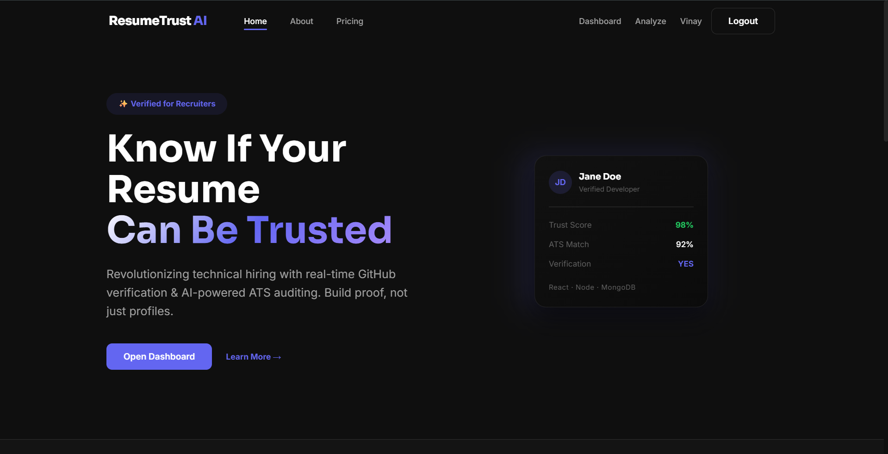
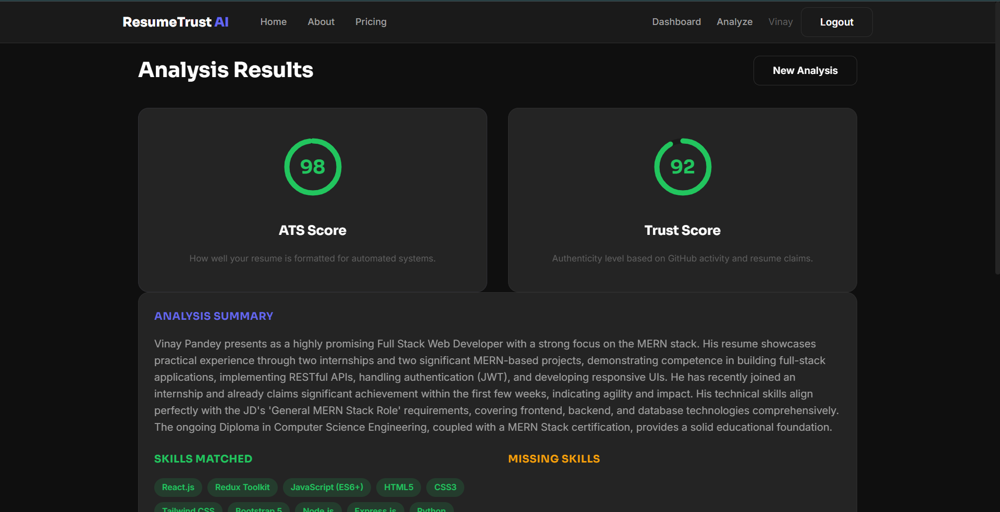
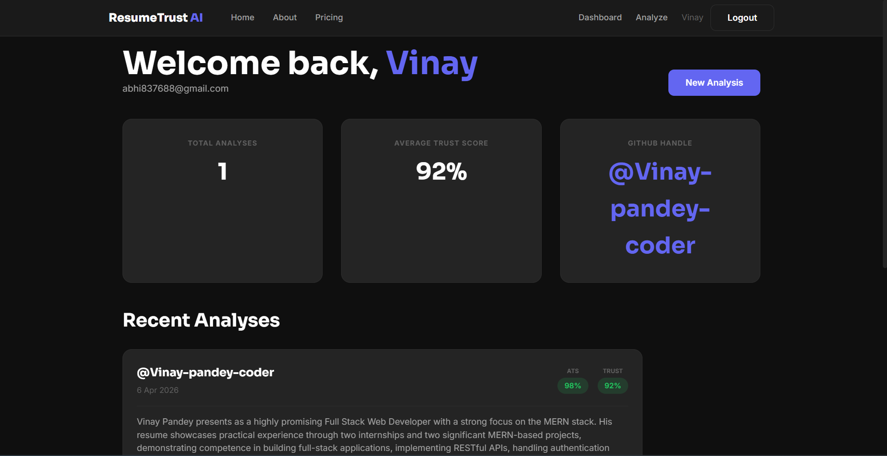

# ResumeTrust AI 🛡️



> **AI-powered resume verification platform** that combines ATS scoring with real-time GitHub analysis to build trust between candidates and recruiters.

🌐 **Live Demo:** [resume-trust-ai-wccy.vercel.app](https://resume-trust-ai-wccy.vercel.app)

---

## 📌 What Problem Does This Solve?

The tech hiring process is broken. Recruiters struggle with exaggerated resumes, while honest candidates struggle to stand out. ResumeTrust AI bridges this gap by **verifying resume claims against actual GitHub activity** — not just scanning keywords.

---

## 🚀 Key Features

### 🤖 AI-Powered Analysis
- **ATS Score** — Matches resume keywords against Job Description (0–100)
- **Trust Score** — Cross-references resume claims with GitHub activity (0–100)
- **Smart Red Flag Detection** — Flags only genuine inconsistencies, not valid data
- **AI-Powered Recommendations** — Powered by Gemini 2.5 Flash

### 👥 Dual Role System
| Feature | Candidate | Recruiter |
|---|---|---|
| Analyze resume | ✅ Own profile only | ✅ Any candidate |
| GitHub handle | 🔒 Auto-locked at register | ✏️ Open input |
| History dashboard | ✅ | ✅ |
| Security gate | 403 if mismatch | Bypassed |
| JD matching | ✅ | ✅ Strict check |

### 💎 Smart API Credit Saver
- **24-hour cache system** — Same username within 24 hours returns cached result instantly
- **Zero duplicate storage** — `findOneAndUpdate` ensures one record per user per GitHub handle
- **Auto PDF deletion** — Resume deleted from server immediately after text extraction

### 🔒 Security Architecture
- JWT authentication on every protected route (30-day expiry)
- Candidate GitHub handle locked at registration — backend enforced 403 if bypassed
- Rate limiting: 100 requests / 15 minutes per IP
- CORS restricted to authorized origins only
- Helmet.js security headers

---

## 🧠 How It Actually Works

### 📝 Registration — Two Roles

When a user registers, they choose their role via a checkbox:

**Candidate (checkbox unchecked):**
- Must provide their GitHub username at registration
- This handle gets permanently locked to their account
- They can never analyze anyone else's profile

**Recruiter (checkbox checked):**
- Must provide their LinkedIn Profile URL instead
- Gets elevated access to analyze any candidate's profile

---

### 🔍 ATS Score — How It's Calculated

The ATS Score measures how well a resume matches a Job Description:

1. Candidate uploads their PDF resume
2. Candidate pastes the Job Description
3. AI extracts top keywords from the JD (skills, tools, experience level)
4. Resume text is compared against those keywords
5. Score formula: `(matched keywords ÷ total JD keywords) × 100`

```
JD requires: React, Node.js, MongoDB, Docker, AWS
Resume has:  React, Node.js, MongoDB
→ ATS Score: 60/100
→ Missing Skills: Docker, AWS
```

If a skill or experience level is present in the JD but **absent from the resume**, it moves to the **Missing Skills** section — giving the candidate a clear action list to improve their score.

---

### 🛡️ Trust Score — How It's Calculated

The Trust Score validates whether the skills claimed in the resume are actually backed by GitHub activity:

1. GitHub API fetches the candidate's public repositories
2. Top languages, repo count, stars, and recent activity are analyzed
3. Gemini AI cross-references resume skill claims with actual GitHub data
4. If a claimed skill has **no matching repos or commits** → score drops
5. If GitHub is active and consistent with resume claims → score stays high

```
Resume claims: "Expert in React.js"
GitHub shows:  15 repos, JavaScript dominant, last commit 2 months ago
→ Trust Score: High ✅

Resume claims: "Expert in AI/ML, Blockchain, AWS"
GitHub shows:  2 repos, no relevant language activity
→ Trust Score: Low ⚠️ Red Flag detected
```

---

### 🔄 Candidate Flow — Step by Step

```
1. Register with name, email, password + GitHub username
        ↓
2. Go to Analyze page
   → GitHub handle is auto-filled and LOCKED (cannot be changed)
        ↓
3. Upload PDF resume (max 2MB)
   + Paste Job Description (optional but recommended)
        ↓
4. Backend pipeline runs:
   PDF text extracted → GitHub data fetched → Gemini AI analyzes
        ↓
5. Results appear:
   ATS Score | Trust Score | Skills Matched | Missing Skills
   Recommendations | Red Flags
        ↓
6. PDF is permanently deleted from server
   Results saved to MongoDB history
        ↓
7. If same resume analyzed again within 24 hours:
   → Cached result shown instantly (no AI call, saves credits)
```

---

### 🔄 Recruiter Flow — Step by Step

```
1. Register with name, email, password + LinkedIn URL
        ↓
2. Go to Analyze page
   → GitHub handle input is OPEN (can enter any candidate)
        ↓
3. Upload candidate's PDF resume
   + Paste Job Description (strict JD matching for recruiters)
        ↓
4. Same AI pipeline runs
        ↓
5. Full analysis saved to recruiter's history
   → Can analyze unlimited different candidates
        ↓
6. Dashboard shows all analyzed candidates with scores
```

---

### ♻️ Smart Cache — No Duplicate API Calls

```
Candidate analyzes "vinay-coder" at 10:00 AM
→ Full AI analysis runs, result saved to DB

Same candidate analyzes "vinay-coder" at 11:00 AM (within 24 hours)
→ Cached result returned INSTANTLY
→ No PDF processing, no GitHub API call, no Gemini AI call
→ Credits saved 💎
```

After 24 hours, a fresh analysis runs automatically when requested.

---

## 📂 Project Structure

```
ResumeTrust-AI/
├── client/                      # Frontend (Vite + React)
│   ├── public/
│   │   ├── robots.txt           # SEO crawler instructions
│   │   └── sitemap.xml          # Google sitemap
│   └── src/
│       ├── components/
│       │   ├── Dashboard/       # ScoreCard, AnalysisCard
│       │   ├── Layout/          # Navbar, Footer
│       │   ├── SEO/             # MetaData (react-helmet)
│       │   ├── UI/              # Button, Input, Loader
│       │   └── HowItWorks.jsx   # Interactive tabs component
│       ├── hooks/
│       │   └── useAuth.js       # Global auth state management
│       ├── pages/               # Home, Analyze, Dashboard, About, Pricing
│       ├── services/
│       │   └── api.js           # Axios instance + interceptors
│       └── utils/
│           └── helpers.js       # Date, score, storage utilities
│
└── server/                      # Backend (Node.js + Express)
    └── src/
        ├── config/db.js         # MongoDB connection
        ├── controllers/         # Auth + Resume logic
        ├── middleware/          # JWT protect + Multer upload
        ├── models/              # User, Analysis schemas
        ├── routes/              # /api/auth, /api/resume
        ├── services/            # Gemini AI, GitHub API, PDF parser
        └── utils/               # Error handler, Winston logger
```

---

## ⚙️ API Endpoints

### Auth
```
POST   /api/auth/register    → Register (candidate or recruiter)
POST   /api/auth/login       → Login → returns JWT token
GET    /api/auth/me          → Get current user (protected)
```

### Resume
```
POST   /api/resume/analyze   → Full analysis (PDF + GitHub + JD)
GET    /api/resume/history   → Get user's past analyses (protected)
```

### Sample Response — `/api/resume/analyze`
```json
{
  "success": true,
  "trustScore": 70,
  "atsScore": 90,
  "details": {
    "analysisSummary": "Strong MERN stack developer...",
    "skillsMatched": ["React.js", "Node.js", "MongoDB"],
    "missingSkills": ["Docker", "AWS"],
    "recommendations": ["Add TypeScript to skills section"],
    "redFlags": []
  }
}
```

---

## 🧠 Smart Features Deep Dive

### 24-Hour API Credit Saver
```javascript
// Same GitHub username within 24 hours → return cached result
const recentAnalysis = await Analysis.findOne({
  userId: currentUser.id,
  githubUsername: githubUsername,
  createdAt: { $gt: oneDayAgo }
});
if (recentAnalysis) return cached result; // Skip AI call
```

### Override Logic (No Duplicates)
```javascript
// findOneAndUpdate ensures 1 record per user per GitHub handle
await Analysis.findOneAndUpdate(
  { userId: req.user.id, githubUsername },
  { $set: analysisData },
  { upsert: true, new: true }
);
```

### Security Gate (Backend Enforced)
```javascript
// Candidate can ONLY analyze their own registered handle
if (!currentUser.isRecruiter) {
  if (githubUsername !== currentUser.githubHandle) {
    return res.status(403).json({ message: "Security Alert!" });
  }
}
```

### Weekly Auto-Cleanup
```javascript
// Every Sunday midnight — delete records older than 30 days
cron.schedule('0 0 * * 0', async () => {
  await Analysis.deleteMany({ createdAt: { $lt: thirtyDaysAgo } });
});
```

---

## 🌐 SEO Setup
- Google Search Console verified ✅
- Sitemap submitted (`/sitemap.xml`) ✅
- `robots.txt` configured (blocks `/dashboard`, `/api`) ✅
- Dynamic meta tags via React Helmet Async ✅

---

## 🖼️ Screenshots

| Home Page | Analysis Result | Dashboard |
|-----------|----------------|-----------|
|  |  |  |

---

## 🔮 Upcoming Features (V2)

- [ ] Recruiter mode — compare multiple candidates side by side
- [ ] PDF report export
- [ ] GitHub deep scan (commit quality, PR contributions)
- [ ] LeetCode / coding platform integration
- [ ] Smart resume PDF builder

---

## ⚠️ Disclaimer

> [!IMPORTANT]
> **This project is created for educational and portfolio purposes only.** > The author (**Vinay Pandey**) does not guarantee 100% accuracy in AI-generated scores or security against all possible vulnerabilities. 
> 
> - **Data Privacy:** We do not sell or share user data. Resumes are deleted from the server immediately after processing.
> - **Liability:** The author is **NOT responsible** for any data leaks, security breaches, or damages caused by the use, modification, or redistribution of this code. 
> - **Use at your own risk.**

---

## 📄 License

MIT License — see [LICENSE](./LICENSE) for details.

---

*Built with ❤️ by [Vinay Pandey](https://github.com/Vinay-pandey-coder)*

[](https://www.linkedin.com/in/vinay-pandey-915310338/)
[](https://github.com/Vinay-pandey-coder)
